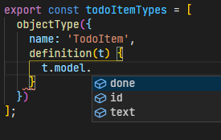

import Link from "../../../src/components/link";

In this article, you will build a simple GraphQL API that tracks todo items. You'll create this using Apollo-Express and it will be consumed by a React frontend. This will focus on getting a boilerplate setup in a monorepo making use of Nx's toolset. The complete code can be found in this repository: <Link to="https://github.com/nvitaterna/nx-react-graphql-starter">nvitaterna/nx-react-graphql-starter</Link>

The

## Libraries and tools

- <Link to="https://nx.dev/">Nx</Link>
- <Link to="https://reactjs.org/">React</Link>
- <Link to="https://graphql.org/">GraphQL</Link>
- <Link to="https://www.apollographql.com/">Apollo</Link>
- <Link to="https://expressjs.com/">Express</Link>
- <Link to="https://nexusjs.org/">Nexus</Link>
- <Link to="https://www.prisma.io/">Prisma</Link>
- <Link to="https://www.graphql-code-generator.com/">
    GraphQL Code Generator
  </Link>

## Create a new workspace

Start by creating an Nx workspace:

```bash
yarn create nx-workspace todo-starter --package-manager yarn
```

You'll be prompted with some questions, answer them as follows:

```bash {2,5,8,11}
? What to create in the new workspace
> react-express     [a workspace with a full stack application (React + Express)]

? Application name
> web-app

? Default stylesheet format
> SASS(.scss)  [ http://sass-lang.com   ]

? Use Nx Cloud? (It's free and doesn't require registration.)
> No
```

After these selections have been made, the Nx CLI will create your workspace. The react-express selection will give you a great boilerplate to build upon. Enter your workspace directory:

```bash
cd todo-starter
```

## Prisma

First, you'll add the `prisma` cli. This will only be needed for development, so install it as a development dependency via the `-D` flag. You'll also need the Prisma client as a regular dependency:

```bash
yarn add prisma -D
yarn add @prisma/client
```

Use the `prisma init` command to get started:

```bash
yarn prisma init
```

This will create a new directory `prisma` in your workspace root which contains a `schema.prisma` file. It will also create a `.env` file in the workspace root. This schema file is your single source of truth for your data models. <Link to="https://pris.ly/d/prisma-schema">Prisma's website</Link> goes more in-depth on what you can do in this file.

Nx has many different plugins that can be used to build applications and libraries. You may see what they offer by running `yarn nx list`. They've also got all sorts of <Link to="https://nx.dev/nx-community">community plugins</Link> if the included ones don't fit your needs.

Create a new `node` library with Nx so you can start organizing your workspace:

```bash
yarn nx generate @nrwl/node:library prisma-client
```

This will create a new node library in `libs/prisma-client`. Note that you will also have an `api-interfaces` library - try and remove this now through the Nx cli:

```bash
yarn nx generate remove api-interfaces
```

You will receive the following error message:

```
api-interfaces is still depended on by the following projects:
web-app
api
```

Nx finds explicit dependencies in your application through import statements. You may also set implicit dependencies manually, which you will need to do later in this tutorial.

Move the `prisma` directory into the `prisma-client` library root and modify your `package.json` file to make the Prisma cli aware of this change:

```json:title=package.json
{
  "prisma": {
    "schema": "libs/prisma-client/prisma/schema.prisma"
  }
}
```

Edit the `schema.prisma` as so:

```prisma:title=libs/prisma-client/prisma/schema.prisma {2,8,11-15}
datasource db {
  provider = "sqlite"
  url      = env("DATABASE_URL")
}

generator client {
  provider = "prisma-client-js"
  output   = "../src"
}

model TodoItem {
  id   Int     @id @default(autoincrement())
  text String
  done Boolean
}
```

You will use `sqlite` as the datasource to avoid the need to spin up a server. Set the Prisma client generation output to a relative directory in the library. You'll be importing this directly in your api so Nx will recognize this dependency. You are also creating a basic `TodoItem` model using Prisma's schema syntax.

You can also go ahead and modify the `.env` file that was created by Prisma, with an SQLite file URL. An absolute path is needed:

```dotenv:title=.env
DATABASE_URL="file:/tmp/todo-starter/todo.db"
```

As a sidenote - Primsa automatically reads .env files in the workspace root. Nx also reads `.env` files via the <Link to="https://www.npmjs.com/package/dotenv">dotenv package</Link>. A more in depth explanation on how Nx reads `.env` files can be found in their <Link to="https://nx.dev/latest/react/guides/environment-variables">environment variables documentation</Link>.

You can create your your database with the <Link to="https://www.prisma.io/docs/concepts/components/prisma-migrate">prisma migrate</Link> command. This command will also create a migrations directory that is used to keep your database in sync with your schema:

```bash
yarn prisma migrate dev --name init
```

Now that your database is set up, you'll continue with setting up the client. Remove the existing src directory in the `prisma-client` library and run the following command to populate a new src directory with your generated Prisma client:

```bash
yarn prisma generate
```

You can read more about what Prisma generates on <Link to="https://www.prisma.io/docs/concepts/components/prisma-client/working-with-prismaclient/generating-prisma-client">its website</Link>. These generated files do not need to be committed to your repository or linted:

```gitignore:title=libs/prisma-client/.gitignore
src
```

```json:title=libs/prisma-client/.eslintrc.json {4}
{
  "ignorePatterns": [
    "!**/*",
    "src"
  ]
}
```

You also need to modify the base `tsconfig.json` file to make typescript play nice with imports:

```json:title=tsconfig.base.json {5}
{
  "compilerOptions": {
    "paths": {
      "@todo-starter/api-interfaces": ["libs/api-interfaces/src/index.ts"],
      "@todo-starter/prisma-client": ["libs/prisma-client/src"]
    }
  }
}
```

## API

### Nexus

The next step is to get your API setup. Start with installing some more packages to get nexus setup:

```bash
yarn add nexus-plugin-prisma \
  nexus \
  graphql
```

You'll also need to add `ts-node` to generate some of the Nexus GraphQL files:

```bash
yarn add -D ts-node
```

You'll also need to add the nexus typings to your `api`'s `tsconfig.json`:

```json:title=apps/api/tsconfig.app.json {5}
{
  "types": [
    "node",
    "express",
    "typegen-nexus-plugin-prisma"
  ]
}
```

Make a new directory in your `api` project's `src` folder to keep your GraphQL code organized named `graphql`.

You will create your context definition file first. Nexus uses this to give you type-safe access to your context object when using custom resolvers and plugins:

```ts:title=apps/api/src/graphql/context.ts
import { PrismaClient } from '@todo-starter/prisma-client';

export interface Context {
  prisma: PrismaClient;
}
```

You'll notice that you are importing the prisma client from your library. Every library can be referenced using the same syntax `@[scope]/[library]`.

Make a new file for your nexus graphql schema as follows:

```ts:title=apps/api/src/graphql/schema.ts
import { makeSchema } from 'nexus';
import { nexusPrisma } from 'nexus-plugin-prisma';
import * as path from 'path';

const PRISMA_PATH = path.resolve('libs/prisma-client/src');

export const schema = makeSchema({
  plugins: [
    nexusPrisma({
      experimentalCRUD: true,
      inputs: {
        prismaClient: PRISMA_PATH,
      }
    }),
  ],
  outputs: {
    schema: path.join(__dirname, '../generated/schema.graphql'),
    typegen: path.join(__dirname, '../generated/nexus.ts'),
  },
  contextType: {
    module: path.join(process.cwd(), 'apps/api/src/graphql/context.ts'),
    export: 'Context',
  },
  types: [],
});
```

You would normally be using relative paths for most of this. In most cases, you don't have to specify where the Prisma client is either. Since we are in a monorepo and everything is run from the root directory you need to use absolute paths. You can read more about the nexus schema options in <Link to="https://nexusjs.org/docs/guides/schema">this guide</Link> from nexusjs.org.

Once again, these generated files do not need to be committed to your repository or linted:

```gitignore:title=apps/api/.gitignore
src/generated
```

```json:title=apps/api/.eslintrc.json {4}
{
  "ignorePatterns": [
    "!**/*",
    "src/generated"
  ]
}
```

You'll notice the empty types array - you'll be populating that soon. Let's start by running ts-node to have nexus generate some files for us:

```bash
yarn ts-node --project ./tsconfig.base.json --compiler-options '{"module":"CommonJS"}' --transpile-only apps/api/src/graphql/schema
```

This will create a couple of files in `apps/api/src/generated`. A `nexus.ts` file for model creation, and a `schema.graphql` file.

Make a new file in the `graphql` directory as follows for creating a TodoItem type, queries, and mutations:

```ts:title=apps/api/src/graphql/todo-item.ts
import { mutationField, objectType, queryField } from 'nexus';

export const todoItemTypes = [
  objectType({
    name: 'TodoItem',
    definition(t) {
      t.model.id();
      t.model.text();
      t.model.done();
    },
  }),
  queryField((t) => {
    t.crud.todoItems();
  }),
  mutationField((t) => {
    t.crud.createOneTodoItem();
  }),
];

```

You'll notice you're getting some errors right now. That is fine. Since there is no `TodoItem` type generated yet, the crud actions don't know of it. You'll fix that shortly.

You'll also notice that the definition function argument already knows which fields are available. This comes from the files you've generated with Nexus and Prisma. This also applies to the crud properties:


This will give Nexus all it needs to create a graphql schema with the proper types, queries, and mutations. Import this file in your nexus schema file and add it to the types array:

```ts:title=apps/api/src/graphql/schema.ts {4,25}
import { makeSchema } from 'nexus';
import { nexusPrisma } from 'nexus-plugin-prisma';
import * as path from 'path';
import { todoItemTypes } from './todo-item';

const PRISMA_PATH = path.resolve('libs/prisma-client/src');

export const schema = makeSchema({
  plugins: [
    nexusPrisma({
      experimentalCRUD: true,
      inputs: {
        prismaClient: PRISMA_PATH,
      },
    }),
  ],
  outputs: {
    schema: path.join(__dirname, '../generated/schema.graphql'),
    typegen: path.join(__dirname, '../generated/nexus.ts'),
  },
  contextType: {
    module: path.join(process.cwd(), 'apps/api/src/graphql/context.ts'),
    export: 'Context',
  },
  types: [todoItemTypes],
});

```

Run the `ts-node` generation again. This will clear the errors in the `todo-item.ts` file as the proper typings will be generated:

```bash
yarn ts-node --project ./tsconfig.base.json --compiler-options '{"module":"CommonJS"}' --transpile-only apps/api/src/graphql/schema
```

Take a look at the GraphQL schema now:

```graphql:title=apps/api/src/generated/schema.graphql
stype Mutation {
  createOneTodoItem(data: TodoItemCreateInput!): TodoItem!
}

type Query {
  todoItems(after: TodoItemWhereUniqueInput, before: TodoItemWhereUniqueInput, first: Int, last: Int): [TodoItem!]!
}

type TodoItem {
  done: Boolean!
  id: Int!
  text: String!
}

input TodoItemCreateInput {
  done: Boolean
  text: String!
}

input TodoItemWhereUniqueInput {
  id: Int
}
```

You'll see that everything you defined in Nexus is in your schema. You're almost ready to start making queries.

### Apollo and Express

You still can't query your newly made GraphQL schema - as it isn't connected to anything yet. Apollo-Express will fix that. Start by adding it to your workspace:

```bash
yarn add apollo-server-express
```

Create a new file in your `graphql` directory with the following to set up the Prisma client - you'll need to feed this to apollo's context function:

```ts:title=apps/api/src/graphql/prisma.ts
import { PrismaClient } from '@todo-starter/prisma-client';

export const prisma = new PrismaClient();
```

Create another file to setup the apollo server:

```ts:title=apps/api/src/graphql/server.ts
import { ApolloServer } from 'apollo-server-express';
import { Context } from './context';
import { prisma } from './prisma';
import { schema } from './schema';

export const server = new ApolloServer({
  schema: schema,
  context: (): Context => {
    return {
      prisma,
    };
  },
});
```

For the last step of your api setup, add the apollo server to the existing express app as follows (while removing the bits you don't need):

```ts:title=apps/api/src/main.ts
import * as express from 'express';
import { server as apolloServer } from './graphql/server';

const app = express();

apolloServer.applyMiddleware({ app });

const port = process.env.port || 3333;
const server = app.listen(port, () => {
  console.log('Listening at http://localhost:' + port);
});
server.on('error', console.error);
```

You may have noticed this no longer imports the `api-interfaces` library. Try and remove it again:

```bash
yarn nx generate remove api-interfaces
```

You will receive the following error message:

```
api-interfaces is still depended on by the following projects:
web-app
```

After removing the imports from the frontend you'll be able to remove the library.

Nx already has plenty of convenience scripts set up for you so go ahead and run the following to start your api:

```bash
yarn start api
```

By default, the app listens on port 3333. Go to <Link to="http://localhost:3333/graphql">http://localhost:3333/graphql</Link> and you will see apollo's GraphQL playground with your schema.

There is an issue - if you try making a query, you'll get an error from Prisma. Let's fix that now by telling Nx to copy over the generated Prisma schema file to the dist directory it runs the api from.

In `workspace.json`, find the block in the `projects` property for your `api` app. Modify the existing `build` target as so. You'll be adding the Prisma schema as another asset:

```json:title=workspace.json {9-13}
{
  "projects": {
    "api": {
      "targets": {
        "build": {
          "options": {
            "assets": [
              "apps/api/src/assets",
              {
                "glob": "schema.prisma",
                "input": "libs/prisma-client/prisma",
                "output": "."
              }
            ]
          }
        }
      }
    }
  }
}
```

Start your api again - and you'll notice it's working now. You can open up the `dist/apps/api` directory and see that the Prisma schema has been copied over.

## Data Access

Let's start with adding some more packages. You'll be using these to generate typings for your frontend application as seen on <Link to="https://www.graphql-code-generator.com/docs/plugins/typescript-react-apollo">graphql-code-generator.com</Link>:

```bash
yarn add -D @graphql-codegen/cli \
  @graphql-codegen/typescript-operations \
  @graphql-codegen/typescript-react-apollo
```

You will now create a react library that the frontend will use to consume your api. Do so via the following command:

```bash
yarn nx generate @nrwl/react:library data-access
```

This will create another library in your libs directory called `data-access`. Let's start by adding a `codegen.yml` file:

```yml:title=libs/data-access/codegen.yml
overwrite: true
schema: 'apps/api/src/generated/schema.graphql'
generates:
  libs/data-access/src/index.tsx:
    documents: 'libs/data-access/graphql/**/*.graphql'
    plugins:
      - typescript
      - typescript-operations
      - typescript-react-apollo
```

Since you are using an index.tsx file instead of index.ts - you need to modify the `tsconfig.base.json` file to point to it correctly. Remove the extension as you did earlier for the Prisma client:

```json:title=tsconfig.base.json {6}
{
  "compilerOptions": {
    "paths": {
      "@todo-starter/api-interfaces": ["libs/api-interfaces/src/index.ts"],
      "@todo-starter/prisma-client": ["libs/prisma-client/src"],
      "@todo-starter/data-access": ["libs/data-access/src/index.tsx"]
    }
  }
}
```

Note that you are referencing the generated schema file from earlier relative to the _root_ directory. This will be a common theme when working with Nx. You are also referencing a `graphql` directory that has not been created - so create that now.

Create a new `todo-item.graphql` file in there with the following. This will give you a few queries that the frontend can use to consume your api:

```graphql:title=libs/data-access/graphql/todo-item.graphql
query TodoItems {
  todoItems {
    id
    text
    done
  }
}

mutation CreateOneTodoItem($text: String!, $done: Boolean = false) {
  createOneTodoItem(data: { text: $text, done: $done }) {
    id
    text
    done
  }
}
```

You'll also install the apollo client now, as the generated file will rely on it:

```bash
yarn add @apollo/client
```

Delete the existing `src` directory and generate files for the frontend:

```bash
yarn graphql-codegen --config libs/data-access/codegen.yml
```

Once again, these files do not need to be committed or linted:

```gitignore:title=libs/data-access/.gitignore
src
```

```json:title=libs/data-access/.eslintrc.json {4}
{
  "ignorePatterns": [
    "!**/*",
    "src"
  ]
}
```
The `index.tsx` file is generated based on your `graphql.schema` file and the queries you created above. It gives you everything you need to consume your api on the frontend.

Now is a good time to move on to the frontend as our api and data access are ready.

## React Client

Create a new `react` library to house your todos feature:

```bash
yarn nx generate @nrwl/react:library feature-todos --style=scss
```

### Todo Components

You'll also create two components for creating and viewing todo items:

```bash
yarn nx generate @nrwl/react:component --name=TodoItemList --export --project=feature-todos --style=scss
yarn nx generate @nrwl/react:component --name=TodoItemForm --export --project=feature-todos --style=scss
```

Modify the `TodoItemList` component as follows:

```tsx:title=libs/feature-todos/src/lib/todo-item-list/todo-item-list.tsx
import React from 'react';
import { useTodoItemsQuery } from '@todo-starter/data-access';

/* eslint-disable-next-line */
export interface TodoItemListProps {}

export function TodoItemList(props: TodoItemListProps) {
  const { loading, error, data } = useTodoItemsQuery();

  if (loading) return <p>Loading...</p>;
  if (error) return <p>Error :(</p>;

  return (
    <ul>
      {data?.todoItems.map(({ id, text, done }) => (
        <li key={id}>
          {text} - <strong>{done ? 'Done' : 'Not Done'}</strong>
        </li>
      ))}
    </ul>
  );
}

export default TodoItemList;
```

```scss:title=libs/feature-todos/src/lib/todo-item-list/todo-item-list.module.scss
ul {
  list-style: none;
  margin: 0;
  font-family: sans-serif;
  width: 100%;
}

li {
  padding: 8px;
  &:nth-child(2n) {
    background-color: #eee;
  }
}
```

Note the import from the `data-access` library - this is a hook generated by the code generation earlier that gives you a type-safe way to query your GraphQL API.

Modify the `TodoItemForm` component as follows:

```tsx:title=libs/feature-todos/src/lib/todo-item-form/todo-item-form.tsx
import React, { useState } from 'react';

import {
  TodoItemsDocument,
  TodoItemsQuery,
  useCreateOneTodoItemMutation,
} from '@todo-starter/data-access';
import './todo-item-form.module.scss';

/* eslint-disable-next-line */
export interface TodoItemFormProps {}

export function TodoItemForm(props: TodoItemFormProps) {
  const [done, setDone] = useState(false);
  const [text, setText] = useState('');

  const [
    createOneTodoItemMutation,
    mutationResult,
  ] = useCreateOneTodoItemMutation({
    variables: {
      text,
      done,
    },
    update(cache, { data }) {
      if (!data) {
        return;
      }
      const { createOneTodoItem } = data;
      const todoItemsQuery = cache.readQuery<TodoItemsQuery>({
        query: TodoItemsDocument,
      });
      if (!todoItemsQuery) {
        return;
      }
      const { todoItems } = todoItemsQuery;

      cache.writeQuery({
        query: TodoItemsDocument,
        data: {
          todoItems: todoItems.concat([createOneTodoItem]),
        },
      });
    },
  });

  const handleSubmit = (event: React.FormEvent<HTMLFormElement>) => {
    event.preventDefault();
    createOneTodoItemMutation();
    setDone(false);
    setText('');
  };

  return (
    <form onSubmit={handleSubmit}>
      <label>
        Text:
        <input
          name="text"
          value={text}
          onChange={(event) => setText(event.target.value)}
        />
      </label>
      <br />
      <label>
        Done:
        <input
          name="done"
          type="checkbox"
          checked={done}
          onChange={(event) => setDone(event.target.checked)}
        />
      </label>
      <button>Create new todo item</button>
    </form>
  );
}

export default TodoItemForm;
```

```scss:title=libs/feature-todos/src/lib/todo-item-form/todo-item-form.module.scss
form {
  font-family: sans-serif;
  border: solid 1px #eee;
  max-width: 240px;
  padding: 24px;
}

input {
  display: block;
  margin-bottom: 8px;
}
```

### Integrating Components

The last step on your front end is to bring the new components into the app and add some styling.

In the `web-app` project, modify `app.tsx` as follows:

```tsx:title=apps/web-app/src/app/app.tsx
import React from 'react';
import { ApolloClient, ApolloProvider, InMemoryCache } from '@apollo/client';
import { TodoItemForm, TodoItemList } from '@todo-starter/feature-todos';
import './app.module.scss';

const client = new ApolloClient({
  uri: '/api/graphql',
  cache: new InMemoryCache(),
});

const App = () => {
  return (
    <ApolloProvider client={client}>
      <h1>Todo Items</h1>
      <div className="flex">
        <TodoItemForm />
        <TodoItemList />
      </div>
    </ApolloProvider>
  );
};

export default App;
```

```scss:title=apps/web-app/src/app/app.module.scss
h1 {
  font-family: sans-serif;
  text-align: center;
}

.flex {
  display: flex;
}

TodoItemList {
  flex: 1;
  padding: 8px;
}
```

You'll notice that you no longer have any references to the original `api-interfaces` library that was created for you. You may remove it now and Nx will not complain:

```bash
yarn nx generate remove api-interfaces
```

Before you start your frontend - you need to modify the default proxy configuration. Nx set this up for you when you generated your workspace in the first step of this walkthrough. The default proxy setup passes all `/api` requests to the api, including the `/api` portion of the path. You don't want that - you want `/api` on your frontend dev server to hit `/` on your api. Modify your `proxy.conf.json` as so to fix this:

```json:title=apps/web-app/proxy.conf.json
{
  "/api": {
    "target": "http://localhost:3333",
    "secure": false,
    "pathRewrite": {
      "^/api": ""
    }
  }
}
```

You can stop your api now if it's still running, and spin up both your `api` and `web-app`with one command via the Nx cli:

```bash
yarn nx run-many --target=serve --all --parallel
```

You should now be able to see your application running on <Link to="http://localhost:4200">http://localhost:4200</Link>.

## Workflow Improvements

Say you want to add a `title` field to your TodoItem model. Go ahead and modify your schema to add this field:

```prisma:title=libs/prisma-client/prisma/schema.prisma {5}
model TodoItem {
  id    Int     @id @default(autoincrement())
  text  String
  done  Boolean @default(false)
  title String?
}
```

You may make another migration as well to reflect the changes on your database. This will create another migration file:

```bash
yarn prisma migrate dev --name add-title-todo
```

The next steps would be to regenerate your Prisma client, regenerate your nexus typings, and regenerate your frontend data accessors. Instead of having to manually run each command every time, you can put this into Nx's workflow via the `workspace.json` file.

For each project that has code generation, you will add another target named `generate-gql` (the name is arbitrary). This will utilize the <Link to="https://nx.dev/latest/angular/workspace/run-commands-executor">run commands</Link> tool from Nx. The commands that you are adding here are were manually run earlier:

```json:title=workspace.json {5-11,16-22,27-33}
{
  "projects": {
    "prisma-client": {
      "targets": {
        "generate-gql": {
          "executor": "@nrwl/workspace:run-commands",
          "options": {
            "command": "yarn prisma generate",
            "outputPath": "libs/prisma-client/src"
          }
        }
      }
    },
    "api": {
      "targets": {
        "generate-gql": {
          "executor": "@nrwl/workspace:run-commands",
          "options": {
            "command": "yarn ts-node --project ./tsconfig.base.json --compiler-options '{\"module\":\"CommonJS\"}' --transpile-only apps/api/src/graphql/schema",
            "outputPath": "apps/api/src/generated"
          }
        }
      }
    },
    "data-access": {
      "targets": {
        "generate-gql": {
          "executor": "@nrwl/workspace:run-commands",
          "options": {
            "command": "yarn graphql-codegen --config libs/data-access/codegen.yml",
            "outputPath": "libs/data-access/src"
          }
        }
      }
    }
  }
}
```

Nx has another option for running commands for <Link to="https://nx.dev/latest/angular/cli/affected">affected</Link> projects. This requires your dependency tree to be set up correctly - which is usually taken care of by imports. You can take a look at the dependency graph by running the following command:

```bash
yarn nx dep-graph
```

The tool will tell you where you can view the dependency graph (<Link to="http://127.0.0.1:4211/">http://127.0.0.1:4211/</Link>). Click the `Select All` button. You'll see that there is a link missing between `data-access` and `api`. This is because there are no actual imports happening - but they should be linked as the `data-access` library depends on the api for code generation.

You can fix that by adding an implicit dependency to the `data-access` project in the `nx.json` file:

```json:title=nx.json {5}
{
  "projects": {
    "data-access": {
      "tags": [],
      "implicitDependencies": ["api"]
    }
  }
}
```

Restart the dependcy graph and you'll see that everything is linked up properly after refreshing the page and selecting all projects again.

Before you run the `generate-gql` command for affected projects, add the following option to your `nx.json` file to make sure that the command gets ran in order of project dependencies as each step relies on the last. You can also add the command to the `cacheableOperations` array so repeated runs are near-instant:

```json:title=nx.json {5,6}
{
  "tasksRunnerOptions": {
    "default": {
      "options": {
        "cacheableOperations": ["build", "lint", "test", "e2e", "generate-gql"],
        "strictlyOrderedTargets": ["generate-gql"]
      }
    }
  }
}
```

Now you can run `generate-gql` for all <Link to="https://nx.dev/latest/angular/cli/affected">affected</Link> projects:

```bash
yarn nx affected --target=generate-gql
```

You'll see this run the `generate-gql` commands you set up above in the correct order based on dependencies. Make a commit via git to save your changes and continue with the next step.

Update your todo item type file file in your `api` project:

```ts:title=apps/api/src/graphql/todo-item.ts {10}
import { mutationField, objectType, queryField } from 'nexus';

export const todoItemTypes = [
  objectType({
    name: 'TodoItem',
    definition(t) {
      t.model.id();
      t.model.text();
      t.model.done();
      t.model.title();
    },
  }),
  queryField((t) => {
    t.crud.todoItems();
  }),
  mutationField((t) => {
    t.crud.createOneTodoItem();
  }),
];
```

Go ahead and run the following. By default, Nx calculates affected projects based on differences from the master branch. You can use the `uncommitted` argument to base it on what hasn't been committed instead:

```bash
yarn nx affected --target=generate-gql --uncommitted
```

You can see that this only runs for the `api` and `data-access` projects - as those are the only two things that are affected by this change. This is Nx's <Link to="https://nx.dev/latest/angular/core-concepts/computation-caching">computation caching</Link> in action.

You now have a full-stack application that can easily be expanded upon while using Nx to share code across projects and improve workflow.
