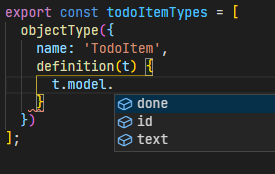

import Link from "../../../src/components/link";

This walkthrough will guide you in setting up a full stack monorepo. It will not go into the specific technologies that you'll be using as it will be focused on setting up a workflow and having everything play together nicely.

This will follow a similar structure to <Link to="https://blog.nrwl.io/using-apollo-graphql-with-react-in-an-nx-workspace-99db8d69cebe">this article</Link> while making changes to the workflow to play nice with Nexus and Prisma. In this article, you will build a very basic 'Todo' GraphQL API that is consumed by a React frontend. This will all be contained in a Nx workspace in a single directory. This walkthrough will be focused on getting a workflow setup.

Just as a heads-up - my environment is Ubuntu 20.04.1 in WSL2, and I'll be using node 14.17.0 and yarn 1.22.10. You can use `todo-starter` as the project name - though you can use whatever name you'd like.

## Libraries and tools

- <Link to="https://nx.dev/">Nx</Link>
- <Link to="https://reactjs.org/">React</Link>
- <Link to="https://graphql.org/">GraphQL</Link>
- <Link to="https://www.apollographql.com/">Apollo</Link>
- <Link to="https://expressjs.com/">Express</Link>
- <Link to="https://nexusjs.org/">Nexus</Link>
- <Link to="https://www.prisma.io/">Prisma</Link>
- <Link to="https://www.graphql-code-generator.com/">
    GraphQL Code Generator
  </Link>

## Create a new workspace

Start by creating an Nx workspace:

```bash noLineNumbers
npx create-nx-workspace todo-starter --package-manager yarn
```

You'll be prompted with some questions, answer them as follows:

```
? What to create in the new workspace
> react-express     [a workspace with a full stack application (React + Express)]

? Application name
> web-app

? Default stylesheet format
> SASS(.scss)  [ http://sass-lang.com   ]

? Use Nx Cloud? (It's free and doesn't require registration.)
> No
```

After these selections have been made, the Nx CLI will create your workspace. Enter your workspace directory:

```bash noLineNumbers
cd todo-starter
```

For the rest of the walkthrough, you will consider this as the "root" directory.

## Prisma Schema, Database Migration, and type Generation

First, you'll add the `prisma` cli. This will only be needed for development, so install it as a development dependency via the `-D` flag. You'll also install the prisma client as it will be needed to actually make the queries to your database:

```bash noLineNumbers
yarn add prisma -D
yarn add @prisma/client
```

Use the `prisma init` command to initialize your prisma schema:

```bash noLineNumbers
yarn prisma init
```

This will create a new directory called `prisma` in your root which contains a `schema.prisma` file. It will also create a `.env` file in your root directory.

Create a new library with Nx so you can start organizing your project:

```bash noLineNumbers
yarn nx generate @nrwl/node:library prisma-client
```

This will create a new library in `libs/prisma-client`. Note that you will also have an `api-interfaces` library - you'll remove that later, just ignore it for now.

Move the `prisma` folder into the `prisma-client` library:

```bash noLineNumbers
mv prisma libs/prisma-client
```

Edit the `schema.prisma` as so:

```prisma:title=libs/prisma-client/prisma/schema.prisma {5,11}
// This is your Prisma schema file,
// learn more about it in the docs: https://pris.ly/d/prisma-schema

datasource db {
  provider = "sqlite"
  url      = env("DATABASE_URL")
}

generator client {
  provider = "prisma-client-js"
  output   = "../src/lib"
}

model TodoItem {
  id   Int     @id @default(autoincrement())
  text String
  done Boolean
}
```

You will use `sqlite` as the datasource to avoid the need to spin up a server. Set the output to a relative folder in the library. By default this gets output to your `node modules` folder. By putting it into this library's source code, it allows Nx to track when changes are made (more on why this matters later on). You are also creating a basic `TodoItem` model using Prisma's schema syntax.

You can also go ahead and modify the `.env` file that was created by prisma, with an sqlite file url. An absolute path is recommended:

```dotenv:title=.env
# Environment variables declared in this file are automatically made available to Prisma.
# See the documentation for more detail: https://pris.ly/d/prisma-schema#using-environment-variables

# Prisma supports the native connection string format for PostgreSQL, MySQL and SQLite.
# See the documentation for all the connection string options: https://pris.ly/d/connection-strings

DATABASE_URL="file:/tmp/todo-starter/todo.db"
```

You can create your your database with the `prisma migrate` command as shown <Link to="https://www.prisma.io/docs/concepts/components/prisma-migrate">here</Link>. This will create your database in the `DATABASE_URL` location you specified above. This command will also create a migrations folder that is used to keep your database in sync with your schema:

```bash noLineNumbers
yarn prisma migrate dev --name init --schema libs/prisma-client/prisma/schema.prisma
```

Now that your database is setup, you'll continue with setting up the client. Remove the existing lib folder in the prisma-client library:

```bash noLineNumbers
rm -rf libs/prisma-client/src/lib
```

Run the following command to populate that directory with your generated prisma client. The `schema` argument is required as prisma is no longer in the default location:

```bash noLineNumbers
yarn prisma generate --schema libs/prisma-client/prisma/schema.prisma
```

You can read more about what prisma generates <Link to="">here</Link>. Modify the prisma-client library's index file to point to these generated files:

```ts:title=libs/prisma-client/src/index.ts
export * from './lib';
```

These generated files do not need to be commited to your repository. Create a `.gitignore` file in the `prisma-client` library:

```gitignore:title=libs/prisma-client/.gitignore
src/lib
```

## API

### Nexus

The next step is to get your API setup. Start with installing some more packages to get nexus setup:

```bash noLineNumbers
yarn add nexus-plugin-prisma \
  nexus \
  graphql
```

You'll also need to add `ts-node` to generate some of the nexus graphql files:

```bash noLineNumbers
yarn add -D ts-node
```

You'll also need to add the nexus typings to your api:

```json:title=apps/api/tsconfig.app.json {5}
{
  "types": [
    "node",
    "express",
    "typegen-nexus-plugin-prisma"
  ]
}
```

Make a new folder in your api app to keep your graphql code organized:

```bash noLineNumbers
mkdir apps/api/src/graphql
```

You will create your context definition file first. Nexus uses this to give you type-safe access to your context object when using custom resolvers and plugins:

```ts:title= apps/api/src/graphql/context.ts
import { PrismaClient } from '@todo-starter/prisma-client';

export interface Context {
  prisma: PrismaClient;
}
```

You'll notice that you are importing the prisma client from your library. Every library can be referenced using the same syntax `@[scope]/[library]`.

Make a new file for your nexus graphql schema as follows:

```ts:title=apps/api/src/graphql/schema.ts
import { makeSchema } from 'nexus';
import { nexusPrisma } from 'nexus-plugin-prisma';
import * as path from 'path';

const PRISMA_PATH = path.resolve('libs/prisma-client/src/lib');

export const schema = makeSchema({
  plugins: [
    nexusPrisma({
      experimentalCRUD: true,
      inputs: {
        prismaClient: PRISMA_PATH,
      }
    }),
  ],
  outputs: {
    schema: path.join(__dirname, '../generated/schema.graphql'),
    typegen: path.join(__dirname, '../generated/nexus.d.ts'),
  },
  contextType: {
    module: path.join(process.cwd(), 'apps/api/src/graphql/context.ts'),
    export: 'Context',
  },
  types: [],
});
```

So there is quite a bit going on here. In general - you'd normally be using relative paths for most of this. In most cases you don't have to specify where the prisma client is either. Since we are in a monorepo and everything is run from the root directory you need to use absolute paths. You can read more about the nexus schema options in <Link to="https://nexusjs.org/docs/guides/schema">this guide</Link> from nexusjs.org.

You'll notice the empty types array - you'll be populating that soon. Let's start by running ts-node to have nexus generate some files for us:

```bash noLineNumbers
yarn ts-node --project ./tsconfig.base.json --compiler-options '{"module":"CommonJS"}' --transpile-only apps/api/src/graphql/schema
```

This will create a couple files in `apps/api/src/generated` that will be used to help you create models, which is what you'll do next. Make a new file in the graphql directory as follows:

```ts:title=apps/api/src/graphql/todo-item.ts
import { mutationField, objectType, queryField } from 'nexus';

export const todoItemTypes = [
  objectType({
    name: 'TodoItem',
    definition(t) {
      t.model.id();
      t.model.text();
      t.model.done();
    },
  }),
  queryField((t) => {
    t.crud.todoItems({
      filtering: true,
    });
    t.crud.todoItem();
  }),
  mutationField((t) => {
    t.crud.createOneTodoItem();
    t.crud.deleteOneTodoItem();
    t.crud.updateOneTodoItem();
  }),
];

```

You'll notice you're getting some errors right now. That is fine. Since there is no `TodoItem` type generated yet, the crud actions don't have knowledge of it. You'll fix that shortly.

> If you're typing along in an editor with intellisense you'll notice that the definition function argument already knows which fields are available. This comes from the files you've generated with nexus and prisma. This also applies to the crud properties:
> 

This will give nexus all it needs to create a graphql schema with the proper types, queries, and mutations. Import this file in your nexus schema file and add it to the types array:

```ts:title=apps/api/src/graphql/schema.ts {4,25}
import { makeSchema } from 'nexus';
import { nexusPrisma } from 'nexus-plugin-prisma';
import * as path from 'path';
import { todoItemTypes } from './todo-item';

const PRISMA_PATH = path.resolve('libs/prisma-client/src/lib');

export const schema = makeSchema({
  plugins: [
    nexusPrisma({
      experimentalCRUD: true,
      inputs: {
        prismaClient: PRISMA_PATH,
      },
    }),
  ],
  outputs: {
    schema: path.join(__dirname, '../generated/schema.graphql'),
    typegen: path.join(__dirname, '../generated/nexus.ts'),
  },
  contextType: {
    module: path.join(process.cwd(), 'apps/api/src/graphql/context.ts'),
    export: 'Context',
  },
  types: [todoItemTypes],
});

```

Run the `ts-node` generation again. This will clear the errors in the `todo-item.ts` file as the proper typings will be generated:

```bash noLineNumbers
yarn ts-node --project ./tsconfig.base.json --compiler-options '{"module":"CommonJS"}' --transpile-only apps/api/src/graphql/schema
```

### Apollo and Express

You still can't query your newly made graphql schema - as it isn't connected to anything yet. Apollo and express will fix that. Start by adding it to your project:

```bash noLineNumbers
yarn add apollo-server-express
```

Create a new file in your `graphql` folder with the following to set up the prisma client - you'll need to feed this to apollo's context function:

```ts:title=apps/api/src/graphql/prisma.ts
import { PrismaClient } from '@todo-starter/prisma-client';

export const prisma = new PrismaClient();
```

Create another file to setup the apollo server:

```ts:title=apps/api/src/graphql/server.ts
import { ApolloServer } from 'apollo-server-express';
import { Context } from './context';
import { prisma } from './prisma';
import { schema } from './schema';

export const server = new ApolloServer({
  schema: schema,
  context: (): Context => {
    return {
      prisma,
    };
  },
});
```

For the last step of your api (for now), add the apollo server to the existing express app as follows (while removing the bits you don't need):

```ts:title=apps/api/src/main.ts
import * as express from 'express';
import { server as apolloServer } from './graphql/server';

const app = express();

apolloServer.applyMiddleware({ app });

const port = process.env.port || 3333;
const server = app.listen(port, () => {
  console.log('Listening at http://localhost:' + port);
});
server.on('error', console.error);
```
Nx already has plenty of convenience scripts setup for you so go ahead and run the following to start your api:

```bash noLineNumbers
yarn start api
```

By default, the app listens on port 3333. Go to <Link to="http://localhost:3333/graphql">http://localhost:3333/graphql</Link> and you will see apollo's graphql playground with your queries, mutations, and types ready to go.